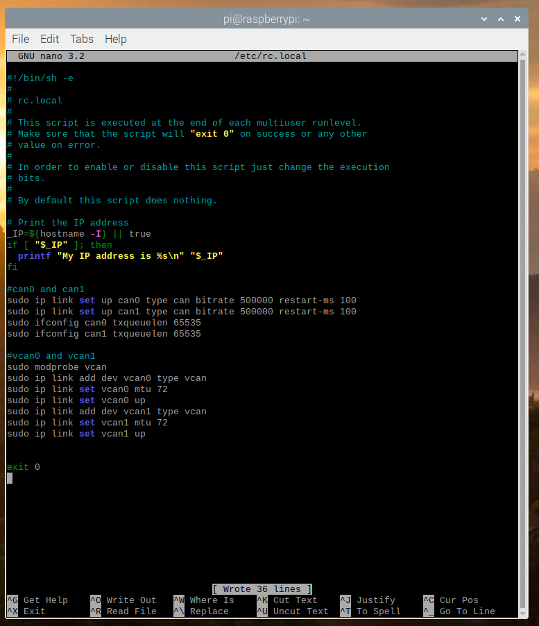

# WaveShare-2Ch-CAN-FD-Hat
Instructions For WaveShare 2ch CAN-FD Hat Installation

## Table of Contents
Work In Progress, check back soon for updates...


## Cloning Repository and Dependency Installation
**Clone Repository**
```sh
$ git clone https://github.com/mitchdetailed/WaveShare-2Ch-CAN-FD-Hat.git
```

**Go into the directory and install the BCM2835 Library** 
```sh
$ sudo apt-get install automake
$ cd ./WaveShare-2Ch-CAN-FD-Hat/bcm2835-1.60/
$ sudo ./configure
$ sudo make
$ sudo make check
$ sudo make install
```

**Install WiringPi Library** 
```sh
$ sudo apt-get install wiringpi
$ cd /tmp
$ wget https://project-downloads.drogon.net/wiringpi-latest.deb
$ sudo dpkg -i wiringpi-latest.deb
$ gpio -v
```

**Install Python3 Libraries**
```sh
$ sudo apt-get update
$ sudo apt-get install python3-pip python3-pil python3-numpy
$ sudo pip3 install RPi.GPIO spidev python-can
```

## Driver Installation
**Mode A Driver Installation** 

**Navigate to the Mode A Directory, If Repository was cloned into the home directory**
```sh
$ cd
$ cd ./WaveShare-2Ch-CAN-FD-Hat/WaveShare/Raspberry\ Pi/Linux\ driver
$ sudo chmod -R 777 A\ mode/
$ cd A\ mode/
$ sudo ./install.sh
```

go grab a drink, this will take about 15 minutes before you can reboot.

**Checking configuration and more setup**

You can check that the drivers were installed correctly by typing the command below..
```sh
dmesg | grep spi
```
It should say ": MCP2517 successfully initialized." on both lines.


## Setup on startup
We can set up the interfaces with a specific bitrate on startup if desired, to do so..
```sh
$ sudo nano /etc/rc.local
```
we'll want to add these commands to the file just above exit 0.

```sh
#can0 and can1
sudo ip link set up can0 type can bitrate 500000 restart-ms 100
sudo ip link set up can1 type can bitrate 500000 restart-ms 100
sudo ifconfig can0 txqueuelen 65535
sudo ifconfig can1 txqueuelen 65535

#vcan0 and vcan1
sudo modprobe vcan
sudo ip link add dev vcan0 type vcan
sudo ip link set vcan0 mtu 72
sudo ip link set vcan0 up
sudo ip link add dev vcan1 type vcan
sudo ip link set vcan1 mtu 72
sudo ip link set vcan1 up
```
change the bitrate to whatever your bitrate needed is.. 




**Extra : update all pip3 packages and distro**

To update the distro : 
```sh
$ sudo apt update
$ sudo apt full-upgrade
```

To update all capable pip packages : 
```sh
$ pip3 list --format=freeze | grep -v '^\-e' | cut -d = -f 1 | xargs -n1 pip3 install -U 
```
And you're ready to Go! 

references : 
- [WaveShare Wiki](https://www.waveshare.com/wiki/2-CH_CAN_FD_HAT)
 - [Kernel networking file](https://www.kernel.org/doc/Documentation/networking/can.txt)
 - [tuschenskis blog](http://dtuchsch.github.io/linux/can/socketcan/2015/12/13/SocketCAN-Intro.html)
 - [elinux.org](https://elinux.org/Bringing_CAN_interface_up)
 - [Car Hackers Handbook](http://opengarages.org/handbook/ebook/)
 - [Python-CAN docs](https://python-can.readthedocs.io/en/master/)

